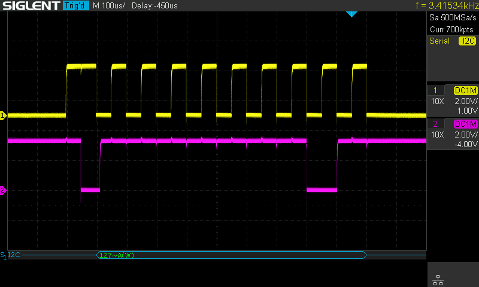
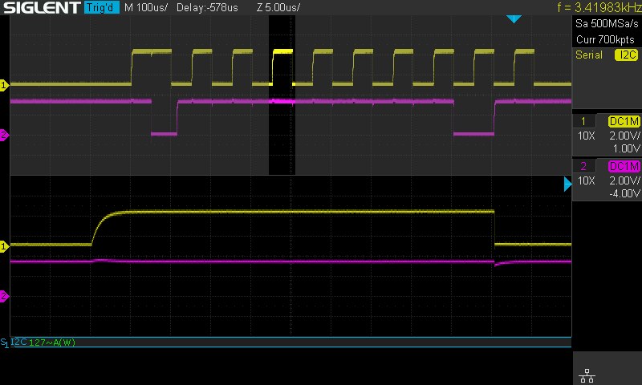
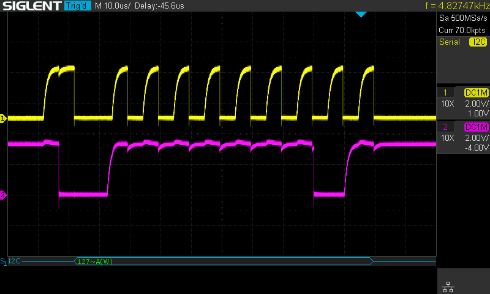
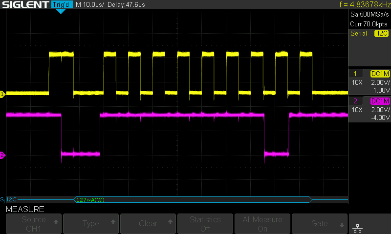
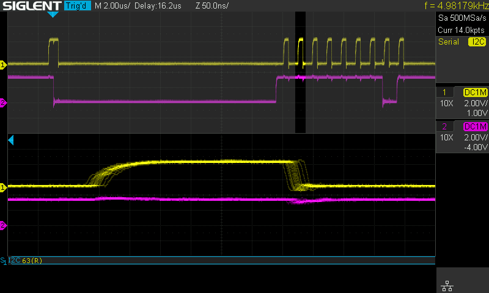

For possibly dubious reasons (the pins were most easily accessible on the [hardware](https://www.st.com/en/evaluation-tools/steval-esc002v1.html)) I decided to attempt using I2C as the control protocol for my brushless ESC project.

Having never used I2C before, I did all the due diligence needed for a hobby project (5 minutes of reading the [wikipedia page](https://en.wikipedia.org/wiki/I%C2%B2C)). You can imagine my surprise when after wiring it all up, nothing worked.

## Intro to I2C

I'll provide just enough background on I2C here to understand the problem I ran into. For further background, the wiki (linked above) provides a succinct introduction.

I2C is a communications protocol supporting two way communications between one or more controllers and one or more targets (ESC in my case, but more typically these are sensors). Since multiple devices can talk on the I2C bus, the protocol (and devices which implement the protocol) needs to gracefully handle the case where more than one device tries to take control of the communication lines at the same time. The way this is done in I2C is to have each device setup its pins in the open drain configuration - allowing any device to actively drive a pin LOW at any time, but never allowing any device to actively drive a pin HIGH. This avoids a case where one device is driving a bus line HIGH while another drives it LOW, which would create a short. However, it means I2C relies on pull-up resistors in order to pull the bus HIGH when in the idle state (when no device is actively pulling it LOW).

## Internal pull-up resistors

The pins I'm using for I2C can also be used as general purpose IO, so they have internal pull-up resistors that can optionally be enabled. Helpfully, the HAL I'm using includes a [configuration option](https://github.com/embassy-rs/embassy/blob/7d8e6649b7d3364d363cacf9696bd9f40f6881a8/embassy-stm32/src/i2c/v2.rs#L22-L25) when setting up I2C to enable these pull-up resistors.

I thought using these internal pull-up resistors would help get things going quickly, but when I configured the I2C peripheral at 1 MHz and loaded up the oscilloscope the signal was so distorted I couldn't make any sense of what I was seeing. Unfortunately I didn't get a screen capture of that, but eventually I slowed the I2C communications down to 10 KHz and started analyzing the wave forms.

These two screen captures show the behavior of the I2C pins from the microcontroller, using only the internal pull-up resistors, while communicating at 10 KHz (ignore the frequency reading at the top right of the screen capture, that is the frequency of the trigger not the underlying bit rate once a transfer starts). Clearly communication is possible at this rate, but especially in the zoomed plot we can begin to see that higher speed communication might be problematic. The rise time here is ~2.5us. One interesting side note is the fall time is several orders of magnitude faster than this - which is caused by the open drain outputs actively pulling the signal down rather than relying on the pull-up resistors.

Moving on to attempt communicaiton at 100 KHz using the internal pull-up resistors, I captured the following.

Compared to the 10 KHz plots I have zoomed in the time axis by a factor of 10, and you can see that when communicating at 100 KHz the rise time of the signal takes nearly the full length of a HIGH clock cycle. This may not be reliable, and it would certainly be unwise to push the speed any higher than this.

## External pull-up resistors

There are many versions of the I2C spec, depending on what speeds a given device supports. But most devices should be capable of sinking 3 mA of current on their I2C pins. At a logic level of 3.3 volts, this means roughly a 1 kOhm resistor should be safe. If you are implementing this in your own circuits, please check the data sheets of your devices before moving forward.

With a 1 kOhm pull-up resistor on each of the I2C lines, 100 KHz communication looks a lot better.

Communication at 1 MHz is also feasible in this configuration, although you'll note that once again the rise time starts becoming a more significant fraction of the total HIGH time for a clock cycle.

One other interesting thing to note in the 1 MHz capture is the long delay at the start of communications. This looks similar to a case of clock stretching, but there was only one device on this I2C bus when I took these captures. Perhaps there is some configuration option for the I2C peripheral on my microcontroller to specify the minimum I2C start signal time, but I haven't looked at this more closely yet.

## Conclusion

Internal pull-up resistors may be usable for I2C, but don't be surprised if you need to use stronger external pull-up resistors to get things working, especially if you require higher speeds (above say 10 KHz).